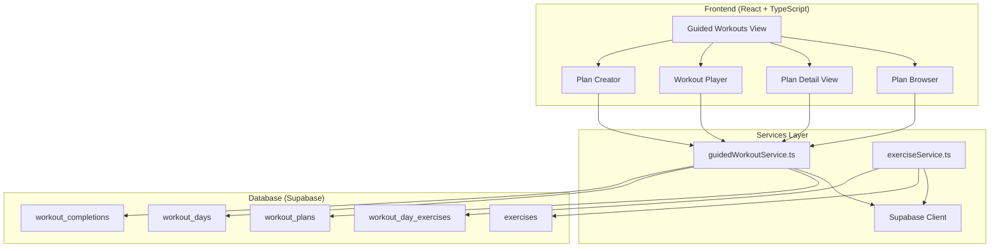

# Design Document

## Overview

The Guided Workouts feature extends the existing NutriSnap fitness app by adding structured workout plans, exercise libraries, and an interactive workout player. The feature integrates seamlessly with the current React + TypeScript + Supabase architecture, leveraging existing patterns for authentication, data management, and UI components.

The system consists of four main components: a workout plans browser, a plan detail viewer, an interactive workout player, and administrative tools for managing exercises and default plans. The feature maintains consistency with the existing app's design patterns while introducing new capabilities for guided fitness routines.

## Architecture

### High-Level Architecture



### Integration with Existing App

The feature integrates with the current app structure by:

1. **Navigation**: Adding a new route `/guided-workouts` accessible from the existing BottomNav
2. **Authentication**: Using the existing `currentUserId` and Supabase auth system
3. **Data Patterns**: Following the established service layer pattern with `guidedWorkoutService.ts`
4. **UI Consistency**: Using existing Tailwind classes and component patterns
5. **State Management**: Leveraging React state patterns already established in the app

## Components and Interfaces

### Data Models

Based on the existing `types.ts` patterns, new interfaces will be added:

```typescript
// Workout Plans
export interface WorkoutPlan {
  id: string;
  user_id?: string; // null for default plans
  title: string;
  description: string;
  duration_minutes: number;
  total_exercises: number;
  est_calories: number;
  created_at: string;
}

// Workout Days within a plan
export interface WorkoutDay {
  id: string;
  plan_id: string;
  day_number: number;
  title?: string; // e.g., "Upper Body", "Cardio Day"
}

// Exercise definitions
export interface Exercise {
  id: string;
  name: string;
  category: string; // e.g., "strength", "cardio", "flexibility"
  duration_seconds?: number;
  reps?: number;
  image_url?: string;
  gif_url?: string;
  instructions: string;
}

// Exercises within a workout day
export interface WorkoutDayExercise {
  id: string;
  day_id: string;
  exercise_id: string;
  sort_order: number;
  exercise?: Exercise; // Populated via join
}

// Workout completion tracking
export interface WorkoutCompletion {
  id: string;
  user_id: string;
  plan_id: string;
  day_id: string;
  completed_at: string;
  duration_minutes: number;
  exercises_completed: number;
  total_exercises: number;
}

// Player state for workout session
export interface WorkoutPlayerState {
  planId: string;
  dayId: string;
  exercises: (WorkoutDayExercise & { exercise: Exercise })[];
  currentExerciseIndex: number;
  isPlaying: boolean;
  isPaused: boolean;
  timeRemaining?: number;
  startTime: Date;
}
```

### Component Structure

```
components/
├── guided-workouts/
│   ├── GuidedWorkoutsView.tsx          # Main container component
│   ├── WorkoutPlanBrowser.tsx          # Browse available plans
│   ├── WorkoutPlanDetail.tsx           # Detailed plan view
│   ├── WorkoutPlayer.tsx               # Interactive workout session
│   ├── WorkoutPlanCreator.tsx          # Create custom plans
│   ├── ExerciseLibrary.tsx             # Browse/manage exercises
│   └── components/
│       ├── PlanCard.tsx                # Individual plan display
│       ├── ExerciseCard.tsx            # Exercise display component
│       ├── DayAccordion.tsx            # Expandable day view
│       ├── PlayerControls.tsx          # Play/pause/next controls
│       ├── ExerciseTimer.tsx           # Countdown timer
│       └── ProgressIndicator.tsx       # Workout progress bar
```

### Service Layer

Following the existing pattern in `supabaseService.ts`, new services will be created:

```typescript
// services/guidedWorkoutService.ts
export const guidedWorkoutService = {
  // Plan management
  getWorkoutPlans(userId?: string): Promise<WorkoutPlan[]>
  getWorkoutPlan(planId: string): Promise<WorkoutPlan>
  createWorkoutPlan(plan: Omit<WorkoutPlan, 'id' | 'created_at'>, userId: string): Promise<WorkoutPlan>
  updateWorkoutPlan(plan: WorkoutPlan, userId: string): Promise<WorkoutPlan>
  deleteWorkoutPlan(planId: string, userId: string): Promise<void>
  
  // Day management
  getWorkoutDays(planId: string): Promise<WorkoutDay[]>
  createWorkoutDay(day: Omit<WorkoutDay, 'id'>, userId: string): Promise<WorkoutDay>
  
  // Exercise assignment
  getWorkoutDayExercises(dayId: string): Promise<(WorkoutDayExercise & { exercise: Exercise })[]>
  addExerciseToDay(dayId: string, exerciseId: string, sortOrder: number): Promise<WorkoutDayExercise>
  
  // Completion tracking
  recordWorkoutCompletion(completion: Omit<WorkoutCompletion, 'id' | 'completed_at'>): Promise<WorkoutCompletion>
  getWorkoutHistory(userId: string, days?: number): Promise<WorkoutCompletion[]>
}

// services/exerciseService.ts
export const exerciseService = {
  getExercises(category?: string): Promise<Exercise[]>
  getExercise(exerciseId: string): Promise<Exercise>
  createExercise(exercise: Omit<Exercise, 'id'>): Promise<Exercise>
  updateExercise(exercise: Exercise): Promise<Exercise>
  deleteExercise(exerciseId: string): Promise<void>
}
```

## Data Models

### Database Schema

The database schema extends the existing Supabase structure:

```sql
-- Workout Plans (can be default or user-created)
CREATE TABLE workout_plans (
  id uuid PRIMARY KEY DEFAULT gen_random_uuid(),
  user_id uuid REFERENCES auth.users(id) ON DELETE CASCADE, -- NULL for default plans
  title text NOT NULL,
  description text,
  duration_minutes int,
  total_exercises int,
  est_calories int,
  created_at timestamptz DEFAULT now()
);

-- Days within a workout plan
CREATE TABLE workout_days (
  id uuid PRIMARY KEY DEFAULT gen_random_uuid(),
  plan_id uuid REFERENCES workout_plans(id) ON DELETE CASCADE,
  day_number int NOT NULL,
  title text, -- Optional day title like "Upper Body"
  UNIQUE(plan_id, day_number)
);

-- Exercise library
CREATE TABLE exercises (
  id uuid PRIMARY KEY DEFAULT gen_random_uuid(),
  name text NOT NULL,
  category text NOT NULL,
  duration_seconds int,
  reps int,
  image_url text,
  gif_url text,
  instructions text NOT NULL,
  created_at timestamptz DEFAULT now()
);

-- Exercises assigned to workout days
CREATE TABLE workout_day_exercises (
  id uuid PRIMARY KEY DEFAULT gen_random_uuid(),
  day_id uuid REFERENCES workout_days(id) ON DELETE CASCADE,
  exercise_id uuid REFERENCES exercises(id) ON DELETE CASCADE,
  sort_order int NOT NULL,
  UNIQUE(day_id, sort_order)
);

-- Workout completion tracking
CREATE TABLE workout_completions (
  id uuid PRIMARY KEY DEFAULT gen_random_uuid(),
  user_id uuid REFERENCES auth.users(id) ON DELETE CASCADE,
  plan_id uuid REFERENCES workout_plans(id) ON DELETE CASCADE,
  day_id uuid REFERENCES workout_days(id) ON DELETE CASCADE,
  completed_at timestamptz DEFAULT now(),
  duration_minutes int NOT NULL,
  exercises_completed int NOT NULL,
  total_exercises int NOT NULL
);

-- Indexes for performance
CREATE INDEX idx_workout_plans_user_id ON workout_plans(user_id);
CREATE INDEX idx_workout_days_plan_id ON workout_days(plan_id);
CREATE INDEX idx_workout_day_exercises_day_id ON workout_day_exercises(day_id);
CREATE INDEX idx_workout_completions_user_id ON workout_completions(user_id);
CREATE INDEX idx_exercises_category ON exercises(category);
```

### Row Level Security (RLS)

Following Supabase best practices:

```sql
-- Enable RLS
ALTER TABLE workout_plans ENABLE ROW LEVEL SECURITY;
ALTER TABLE workout_days ENABLE ROW LEVEL SECURITY;
ALTER TABLE exercises ENABLE ROW LEVEL SECURITY;
ALTER TABLE workout_day_exercises ENABLE ROW LEVEL SECURITY;
ALTER TABLE workout_completions ENABLE ROW LEVEL SECURITY;

-- Policies for workout_plans
CREATE POLICY "Users can view all plans" ON workout_plans FOR SELECT USING (true);
CREATE POLICY "Users can create their own plans" ON workout_plans FOR INSERT WITH CHECK (auth.uid() = user_id);
CREATE POLICY "Users can update their own plans" ON workout_plans FOR UPDATE USING (auth.uid() = user_id);
CREATE POLICY "Users can delete their own plans" ON workout_plans FOR DELETE USING (auth.uid() = user_id);

-- Policies for workout_days
CREATE POLICY "Users can view days for accessible plans" ON workout_days FOR SELECT USING (
  EXISTS (SELECT 1 FROM workout_plans WHERE id = plan_id AND (user_id IS NULL OR user_id = auth.uid()))
);

-- Similar policies for other tables...
```

## Error Handling

### Client-Side Error Handling

Following the existing error handling patterns in the app:

```typescript
// Service layer error handling
export const guidedWorkoutService = {
  async getWorkoutPlans(userId?: string): Promise<WorkoutPlan[]> {
    try {
      const query = supabase
        .from('workout_plans')
        .select('*')
        .order('created_at', { ascending: false });
      
      if (userId) {
        query.or(`user_id.is.null,user_id.eq.${userId}`);
      } else {
        query.is('user_id', null);
      }
      
      const { data, error } = await query;
      
      if (error) {
        console.error('Error fetching workout plans:', error);
        throw new Error('Failed to fetch workout plans');
      }
      
      return data || [];
    } catch (error) {
      console.error('Error in getWorkoutPlans:', error);
      throw error;
    }
  }
}

// Component error handling
const [error, setError] = useState<string | null>(null);
const [isLoading, setIsLoading] = useState(false);

const handleStartWorkout = async () => {
  setIsLoading(true);
  setError(null);
  
  try {
    const exercises = await guidedWorkoutService.getWorkoutDayExercises(dayId);
    // Handle success
  } catch (err: any) {
    setError(err.message || 'Failed to start workout');
  } finally {
    setIsLoading(false);
  }
};
```

### Workout Player Error Handling

Special considerations for the workout player:

- **Media Loading Errors**: Graceful fallback when exercise GIFs/images fail to load
- **Timer Interruptions**: Handle app backgrounding/foregrounding during workouts
- **Network Issues**: Cache exercise data for offline workout continuation
- **User Navigation**: Prevent accidental navigation during active workouts

## Testing Strategy

### Unit Testing

Following the existing app patterns, focus on:

1. **Service Layer Testing**: Mock Supabase responses and test data transformations
2. **Component Testing**: Test user interactions and state management
3. **Utility Functions**: Test timer logic, exercise sequencing, and data calculations

### Integration Testing

1. **Database Operations**: Test CRUD operations with test database
2. **Workout Flow**: End-to-end testing of plan selection → workout completion
3. **Authentication Integration**: Test user-specific data access and permissions

### User Acceptance Testing

1. **Workout Experience**: Test complete workout sessions on mobile devices
2. **Performance**: Ensure smooth media playback and timer accuracy
3. **Accessibility**: Test with screen readers and keyboard navigation
4. **Responsive Design**: Test across different screen sizes and orientations

### Performance Considerations

1. **Media Optimization**: Lazy load exercise GIFs and images
2. **Data Caching**: Cache frequently accessed plans and exercises
3. **Bundle Size**: Code splitting for workout player components
4. **Database Queries**: Optimize joins and use appropriate indexes

## Navigation Integration

### Route Structure

```typescript
// Add to existing App.tsx routes
<Route 
  path="/guided-workouts" 
  element={<GuidedWorkoutsView currentUserId={currentUserId} />} 
/>
<Route 
  path="/guided-workouts/plan/:planId" 
  element={<WorkoutPlanDetail currentUserId={currentUserId} />} 
/>
<Route 
  path="/guided-workouts/player/:planId/:dayId" 
  element={<WorkoutPlayer currentUserId={currentUserId} />} 
/>
```

### Bottom Navigation Update

```typescript
// Update BottomNav.tsx to include guided workouts
const navItems = [
  // ... existing items
  {
    id: '/guided-workouts',
    label: 'Guided',
    icon: PlayCircleIcon, // New icon
    color: 'text-orange-600'
  }
];
```

## Mobile Optimization

### Workout Player Mobile Features

1. **Screen Wake Lock**: Prevent screen from sleeping during workouts
2. **Orientation Handling**: Support both portrait and landscape modes
3. **Touch Gestures**: Swipe navigation between exercises
4. **Audio Cues**: Optional audio countdown and exercise announcements
5. **Haptic Feedback**: Vibration for exercise transitions and completion

### Progressive Web App Features

1. **Offline Support**: Cache essential workout data for offline use
2. **Background Sync**: Sync workout completions when connection restored
3. **Push Notifications**: Workout reminders and achievement notifications